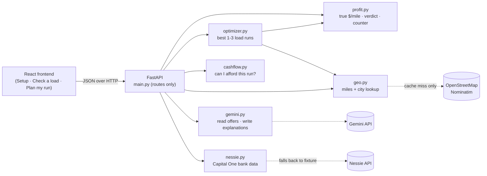

# LoadCheck — VTHacks 14

**$2.40 a mile on paper. $0.53 in your pocket.**

Owner-operator truck drivers get load offers as texts, emails and screenshots. LoadCheck reads the offer
(Gemini), makes the driver confirm it, and then **code** computes what he actually keeps after the empty
drive to pickup, fuel, maintenance, the truck payment and the dispatcher's cut. It finds a better 2–3 load
run that ends near home, checks the run against his real bank balance and bills (Capital One Nessie),
and suggests a counter-offer when a load is close.

> The AI reads the offer and explains the answer. Code does all the math, and we check every number the
> AI says against the math.

What's simulated: the 60-load board (`backend/data/seed_loads.json`, labeled "Simulated" in the UI) and the
Nessie bank data (sandbox data we seeded). Road miles are straight-line × 1.2; hours-of-service rules are
simplified. See `SPEC.md` for the full contract.

---

## Teammates: start here

### 1. One-time setup (10 min)
```bash
git clone https://github.com/Ben-Lomeling/VTHACKS.git
cd VTHACKS
cp .env.example .env                  # put your API key in .env; never commit it

cd backend
python3 -m venv .venv                 # needs Python 3.11 or newer: python3 --version
source .venv/bin/activate             # Windows: .venv\Scripts\activate
pip install -r requirements.txt
pytest -q                             # should be all green
uvicorn app.main:app --reload         # API on http://localhost:8000  (docs: /docs)
```
Check that it's up: http://localhost:8000/api/health lists every module as `stub` or `live`.

### 2. Find your job
| Who | You own (only touch these) | Branch prefix | Paste this into Codex |
|---|---|---|---|
| Nischal (lead) | `backend/app/models.py main.py profit.py geo.py optimizer.py cashflow.py`, their tests, `data/profile.json`, `data/cities.json`, `requirements.txt`, `README.md`, `SPEC.md` | `engine/` | `prompts/1_NISCHAL_engine_fable.md` |
| Gemini teammate | `backend/app/gemini.py`, `backend/tests/test_gemini_*.py`, `backend/tests/fixtures/`, `scripts/eval_extraction.py` | `gemini/` | `prompts/2_TEAMMATE_gemini_codex.md` |
| Nessie teammate | `backend/app/nessie.py`, `scripts/seed_nessie.py`, `scripts/record_fixture.py`, `backend/data/nessie_*.json`, `backend/tests/test_nessie*.py` | `nessie/` | `prompts/3_TEAMMATE_nessie_codex.md` |
| Frontend teammate | everything in `frontend/` | `frontend/` | `prompts/4_TEAMMATE_frontend_codex.md` |

Your module already exists as a **stub** with the exact function signatures and fake data, so the API and
frontend work today. Replace the inside of your functions; **never change a signature, model or route**.
When your module is real, set `STATUS = "live"` at the top of your file.

### 3. How to use Codex
1. Open the repo in Codex. It reads `AGENTS.md` automatically; that holds the rules.
2. Paste your prompt from `prompts/`, then give it **one task at a time** ("Do Task 1 only").
3. Before you accept anything: read the diff, run `pytest -q`, and make sure you can explain it out
   loud in 30 seconds. Judges will ask. "Codex wrote it" costs us points.

### 4. Every task, every time
```bash
git checkout main && git pull                     # always start from fresh main
git checkout -b gemini/extract-validation         # <your prefix>/<short-task-name>
# ... work, then:
cd backend && pytest -q                           # must be green
git add -A && git commit -m "gemini: validate per-mile rates"
git push -u origin gemini/extract-validation
```
Then open a Pull Request on GitHub into `main`, fill in the template (paste your `pytest -q` output),
and ping Nischal in the group chat. Nischal merges. Keep PRs small, and merge at least every 3 hours.

### 5. Rules that keep us from breaking each other
- Only edit files you own (table above). Need a model, route or signature changed? Ask Nischal; he changes
  `SPEC.md` first and tells everyone.
- Never commit `.env`, API keys, or Dad's unredacted texts (strip names, phone numbers, MC numbers).
- Tests never call the network (Gemini/Nessie tests use fixtures or fakes). CI runs `pytest` on every PR.
- Code does all math. Gemini never produces a number we display.
- The backend clock is `DEMO_NOW` in `.env` (default `2026-09-21T06:00`), so the simulated board's
  dates line up. Don't "fix" dates in the data.

### Checkpoints (from the game plan)
- **Sat 12 PM:** paste → confirm → result works end to end on the real backend.
- **Sat 4 PM:** every MVP feature on real data.
- **Sat 6 PM:** feature freeze. Bug fixes only after this.
- **Sun 7:15 AM:** submit on Devpost.

---

## API (running at http://localhost:8000)
| Method | Path | Purpose |
|---|---|---|
| GET/PUT | `/api/profile` | Driver's truck + cost profile |
| POST | `/api/extract` | multipart `text` and/or `image` → extracted load + confidence + warnings |
| POST | `/api/evaluate` | one load → true economics + verdict |
| POST | `/api/offers` | several loads → ranked economics |
| POST | `/api/chains` | best 2–3 load runs that end near home |
| GET | `/api/board` | the simulated load board |
| GET | `/api/costs/from-bank` | costs derived from Capital One Nessie |
| POST | `/api/cashflow` | "can I afford this run?" balance simulation |
| POST | `/api/explain` | plain-English explanation (numbers checked) |
| POST | `/api/counter-message` | message to the broker with the counter rate |
| GET | `/api/health` | which modules are live vs stub |

Interactive docs: http://localhost:8000/docs
Real example request/response for every route: [`docs/api-samples/`](docs/api-samples/)
(regenerate with `python scripts/export_api_samples.py`). Frontend mocks should match these shapes.

## Architecture

Solid arrows are pure Python. Dotted arrows leave the laptop, and each has an offline fallback
(city cache, Nessie fixture, template text) so the demo runs with Wi-Fi off.

## How the decision engine works (the 60-second version)
1. **True profit (`profit.py`).** Rate minus the dispatcher's cut, fuel (empty and loaded mpg), maintenance per
   mile, and fixed costs (truck payment, insurance) spread per mile, over *all* miles including the empty drive
   to pickup. $1,200 for 500 mi looks like $2.40/mi; with 100 empty miles it's $0.53/mi in his pocket.
   Verdict: **take** if he hits his target per mile, **negotiate** if the rate he'd need is within 20% of the
   offer (we give him that number), otherwise **skip**.
2. **Better runs (`optimizer.py`).** Depth-first search over every sequence of 1–3 loads. Each step runs a real
   clock: drive empty, wait for the pickup window, 2 h to load, drive loaded, 2 h to unload, with a simplified
   hours-of-service rule (10 h rest after 11 h driving). Branches die early if the pickup is over 250 empty
   miles away, the window is missed, or the delivery would be late. Score = profit of every leg minus the
   empty drive home. We show the top 3 that end near home, each starting with a different load. 60 loads take
   a few milliseconds.
3. **Cash flow (`cashflow.py`).** Starting from his real bank balance, for this trip (today until he's home):
   diesel goes out on pickup day and bills on their due dates. Broker pay comes weeks later (delivery + payment
   terms), so it's listed but not counted. If he'd go negative on the road, we find the fewest loads that need a
   Capital One advance (paid on delivery day, small fee, repaid when the broker pays) and what it costs.
4. **Honest estimates.** Miles are straight-line × 1.2, driving is 50 mph, HOS is simplified. We say so.

## Known simplifications
**Hours of service.** We model only the **11-hour driving limit followed by a 10-hour rest** (a 10 h+ wait also
counts as rest). We do **not** model:

| Not modeled | What we'd add next |
|---|---|
| 14-hour on-duty window | Track on-duty time (driving + loading + waiting) since the last rest, and end the day at 14 h even if driving hours remain. |
| 30-minute break after 8 hours of driving | Insert a 30-min stop once 8 cumulative driving hours pass without a break. |
| 70-hour / 8-day cap (and the 34-hour restart) | Carry the driver's recent on-duty hours into the search and stop or insert a 34-h restart when a run would exceed 70. |

**Distance and time.** Road miles are **straight-line (haversine) × 1.2**, and drive time is those miles at a flat
**50 mph**.

| Simplification | What we'd add next |
|---|---|
| Straight-line × 1.2 instead of real road miles | Real road distances and route shapes from a routing engine (e.g. OSRM), cached per city pair so the demo still runs offline. |
| Flat 50 mph | Drive times from the routing engine, which accounts for road type, instead of one average speed. |

## Scripts
| Script | What it does |
|---|---|
| `python scripts/demo_check.py` | Runs the demo flow against the API and prints PASS/FAIL per step, plus story checks. Run before every rehearsal. `--in-process` needs no server. |
| `python scripts/prewarm_cities.py "City, ST" ...` | Caches city coordinates so the demo works offline. Commit `backend/data/cities.json` after. |
| `python scripts/export_api_samples.py` | Refreshes `docs/api-samples/` from the current backend. |
| `python scripts/seed_nessie.py` | Creates the demo bank customer in Nessie (Nessie teammate). |

## Repo layout
```
SPEC.md        the contract: models, formulas, routes, interfaces
AGENTS.md      rules for Codex (and humans)
prompts/       one kickoff prompt per teammate
backend/app/   FastAPI app + modules
backend/data/  seed loads (simulated), profile, city cache, Nessie fixture
backend/tests/ pytest; golden profit test must stay green
scripts/       Nessie seed script, demo checks
frontend/      React + Vite + TS (frontend teammate)
```
